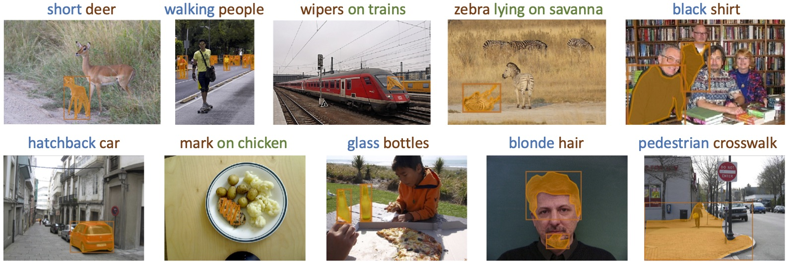
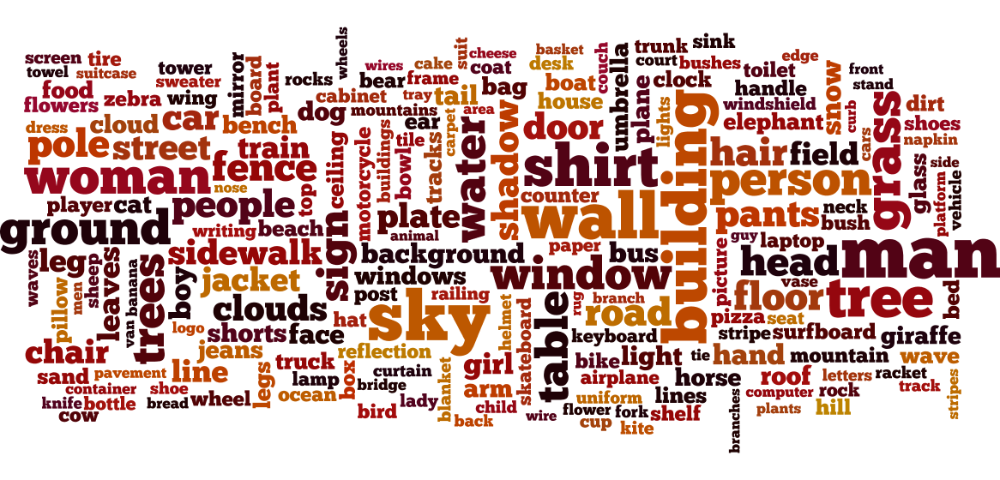
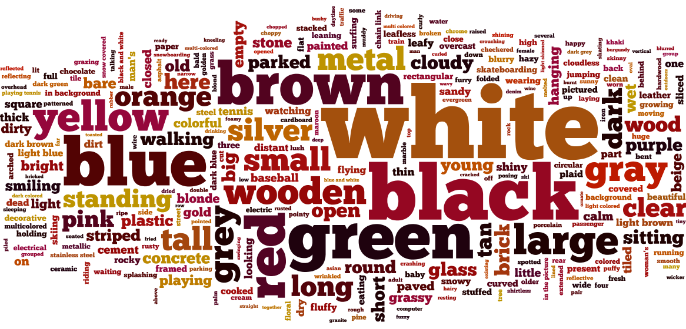

# VGPhraseCut Dataset

<table width="100%">
  <tr>Examples from the dataset:</tr>
  <tr>
  <td></td>
  </tr>
</table>

<table width="100%">
  <tr>Concepts included in the dataset:</tr>
  <tr>
    <td> Category names</td>
    <td> Attributes</td>
    <td> Relationship predicates</td>
  </tr>
  <tr>
    <td></td>
    <td></td>
    <td></td>
  </tr>
</table>

## Introduction

VGPhraseCut Dataset is aimed for the problem of segmenting anything on an image based on a regional description phrase. 

The dataset is collected based on [Visual Genome](https://visualgenome.org/). It contains 348,233 phrase-region pairs. Each phrase contains explicit annotations of which words describe the category name, attributes, and relationships with other things in the image respectively. The corresponding region described by the phrase is a binary segmentation mask on the image.

Our dataset consists of 348,233 phrases across 77,262 images. This roughly covers 70% of the images in Visual Genome. We split the dataset into 308,893 phrases (71,354 images) for training,  20,350 (2971 images) for validation, and 18,980 (2937 images) for testing. For the convenience of debugging, we have a 'miniv' split with only 100 images sampled from the validation split. (Note that the files for the 'validation' split don't contain data of the 100 'miniv' images. Specify `split=val_miniv` if you want to use the whole validation set.)

More dataset statistics and data collection pipeline can be found in the paper. \# TODO: link to the paper.

## Quick Start

 TLDR version to try out the miniv split of our dataset.

```bash
# install dependencies. Python3 required
pip install matplotlib==3.1.1 numpy==1.17.4 pillow==6.1.0 requests==2.22.0 gdown==3.9.0

# clone our repo
git clone git@github.com:ChenyunWu/PhraseCutDataset.git
cd PhraseCutDataset

# download the miniv split
python download_dataset.py -s miniv

# evaluate a random guess baseline on miniv
python evaluate.py -n ins_rand

# visualize the result
python visualize.py -p output/baselines/ins_rand/miniv/pred_eval.npy
```

Then you can check visualizations at [output/baselines/ins_rand/miniv/htmls/all.html](output/baselines/ins_rand/miniv/htmls/all.html)

You can also play around [dataset_demo.ipynb](dataset_demo.ipynb) to view more data examples.

## Links

[Webpage](https://people.cs.umass.edu/~chenyun/phrasecut/)

\# TODO: link to the paper.

## Requirements

- python 3
- numpy
- matplotlib
- pillow
- requests
- gdown

Assuming you already have python 3 installed, you can install  the remaining requirements with 'pip':
```bash
pip install matplotlib==3.1.1 numpy==1.17.4 pillow==6.1.0 requests==2.22.0 gdown==3.9.0
```


## Download the dataset
We suggest you clone this repository to folder `PhraseCutDataset`: 

```
git clone git@github.com:ChenyunWu/PhraseCutDataset.git
```
And download all the dataset files into `PhraseCutDataset/data/VGPhraseCut_v0/`.

If you prefer to put the dataset elsewhere, simply change the 'dataset_dir' in [utils/file_paths.py](utils/file_paths.py) 

### Downloader
We provide [download_dataset.py](download_dataset.py) for downloading the whole dataset.
Using the argument `--split` (or `-s`),  you can specify which split(s) you want to download.
We also provide the following argment settings to specify what annotations you want to download:

- `--download_refer` (default 1): the referring annotations: phrases and corresponding regions
- `--download_img` (default 1): the images used in our dataset. 
  - You can set it to 0 if you already have Visual Genome images saved in your machine, or you prefer downloading the whole Visual Genome image set from [Visual Genome Website](https://visualgenome.org/api/v0/api_home.html).
  We use ~70% of  images from Visual Genome Version 1.2. You will need images in both part1 (9.2GB) and part2 (5.47GB). You may create a symbolic link at `PhraseCutDataset/data/VGPhraseCut_v0/images/`)
- `--download_graph` (default 0):  Visual Genome scene graph annotations on images  used in our dataset
- `--download_skip` (default 0):  phrases skipped by annotators during our dataset collection

Below are some examples of using the downloader.
```bash
# To download only the 'miniv' split: 
python download_dataset.py -s miniv

# To download only the 'val' and 'test' splits: 
python download_dataset.py -s val_test

# To download the whole dataset: 
# (downloading all the images requires ~11G disk space and may take a long time)
python download_dataset.py

# To download the whole dataset except the images:
python download_dataset.py --download_img 0

# To download the whole dataset together with Visual Genome scene graph annotations, 
# and phrases skipped by annotators during our dataset collection:
python download_dataset.py --download_graph 1 --download_skip 1
```

## Explore the dataset 
[dataset_demo.ipynb](dataset_demo.ipynb) shows the usage of our data loader and displays example annotations in our dataset.

## Evaluation
Given predicted regions of each referring phrase , we report:
- Mean/cumulative box IoU (predicted boxes against ground-truth boxes), if predicted boxes are provided
- Mean/cumulative mask IoU (predicted binary mask against ground-truth mask), if predicted masks are provided
- Box / mask accuracy: percentage of predictions where the box / mask IoU is above a threshold
(Thresholds: 0.3, 0.5, 0.7, 0.9)

The statistics can be reported on each subset separately. See [utils/subset.py](utils/subset.py) for supported subsets.


### Option 1: Save predictions to file, and evaluate them afterwards
- **Save predictions to a numpy file.** 
It should be a 'dict' of task_id --> binary predicted mask (compressed by `np.packbits(...)`).
We provide examples of naive predictors in [utils/predictor_examples.py](utils/predictor_examples.py).
- **Evaluate.** 
Run `python evaluate.py --pred_name=your_method_name --pred_path=path/to/your/predictions.npy`.
The optional 'pred_name' is only used to log results to summary files for the convenience of comparing different methods.

### Option 2: Evaluate after predicting on each image
Saving all the prediction results to a file can take up a lot of space and time. 
We provide the ['Evaluator'](utils/evaluator.py) class to update the evaluation after predicting on each image, so that predictions on previous tasks do not need to be saved.

First initialize an evaluator, then enumerate over images and call `evaluator.eval_single_img(...)` after predicting on all referring phrases of each image, finally call `evaluator.analyze_stats(...)` to get the final evaluation results.
See the 'evaluate_from_pred_dict' function in [evaluate.py](evaluate.py) as an example.


## Visualization
We provide a tool to visualize prediction results in html files, align with ground-truth and \(optionally\) other baselines.
Run `python visualize.py -p path/to/your/predictions.npy`, and the visualizations will be created in the same directory.

Similar as the 'Evaluator', we also provide a ['Visualizer'](utils/visualizer.py) to generate visualizations after predicting on each task, avoiding saving all the prediction results. 

To try out the evaluation and visualization code on 'miniv' split with our naive predictors, you can simply run:
```bash
# from the "PhraseCutDataset" directory:
python evaluate.py -n ins_rand
python visualize.py -p output/baselines/ins_rand/miniv/pred_eval.npy 
```

## Additional utilities
- [**Simple predictors**](utils/predictor_examples.py): example naive predictors.
- **Loaders**: 
[RefVGLoader](utils/refvg_loader.py) loads the dataset from files. It uses [PhraseHandler](utils/phrase_handler.py) to handle the phrases, and (optionally) [VGLoader](utils/vg_loader.py) to load Visual Genome scene graphs.
- [**ThreshBinSearcher**](utils/find_thresh.py): efficiently searches the thresholds on final prediction scores given the overall percentage of pixels predicted as the referred region. 
- [**Data transfer**](utils/data_transfer.py): changes representations of boxes, polygons, masks, etc.
- [**IoU**](utils/iou.py): calculates IoU between boxes, polygons, masks, etc.
- [**Subset**](utils/subset.py): decides qualified subsets for each task (phrase-region pair). 

## Annotation data structure

All VGPhraseCut annotation files are shared through this [Google Drive link](https://drive.google.com/drive/folders/1oxRFGV_JHZO6dZSpeBSXNf9J_VLCkgL0?usp=sharing). 

###  Metadata:

- `image_data_split3000.json`(15.8MB): 
  List of image information from Visual Genome.
  For each image, there is a 'dict' containing its 'image_id', 'coco_id', 'flickr_id', 'width', 'height', 'url', and also its split in our VGPhraseCut dataset: 'split'=train/val/test/miniv.  
- `name_att_rel_count.json`(348KB):
  List of category names, attributes and relationship predicates in our dataset, together with their frequency.

###  Referring data:

- `refer_train.json`(399.2MB)
- `refer_val.json`(46.5MB)
- `refer_test.json`(46.6MB)
- `refer_miniv.json`(335KB)

They are separate files for the different splits. 
Each file contains a list of tasks. Each task stands for a phrase-region pair, organized as a 'dict' with following keys: 

- **task_id**: unique id for each phrase-region pair (constructed from image_id and ann_ids)
- **image_id**: image id from Visual Genome
- **ann_ids**: all object ids (in Visual Genome) that match with the phrase
- **instance_boxes**: list of referred instance boxes (xywh format)
- **Polygons**: list of "instance_polygons", same length as instance_boxes. 
  "instance_polygons": list of "polygon"s for a single instance. 
  "polygon": list of \[x, y\] points, representing one polygon.
- **phrase**: the referring phrase as a string
- **phrase_structure**: Structure of the phrase stored as
  'dict' of ('name', 'attributes', 'relation_ids', 'relation_descriptions', 'type')
    - name: category name as a string
    - attributes: list of attributes as a list of strings    
    - relation_ids: list of relationship ids from Visual Genome
    - relation_descriptions: list of relation_descriptions. 
      Each relation_description is a tuple of two elements: 
      string for the predicate, string (name) for the supporting object
    - type: name (category name is unique), 
      attribute (att+name is unique), 
      relation (name+relation is unique), verbose (not unique)

###  (Optional) Visual Genome scene graph data:

- `scene_graphs_train.json`(486.1MB)
- `scene_graphs_val.json`(19.3MB)
- `scene_graphs_test.json`(19.2MB)
- `scene_graphs_miniv.json`(116KB)

Only needed if you want to use associated Visual Genome scene graph annotations together with our dataset.
They are the same as the scene graphs from Visual Genome v1.2, with only annotations on images in our dataset.


###  (Optional) Skipped data:

- `skip.json`(11MB)

Only needed if you are interested in the phrases skipped by the annotators during data collection.
We provide 'task_id', 'image_id', 'ann_ids', 'phrase', 'phrase_structure', and also **'reason'**: the reason why it is skipped, where the annotator got to choose from "Wrong Description", "Not in Image", "Ambiguous Region", "Difficult to Select" and "Other".