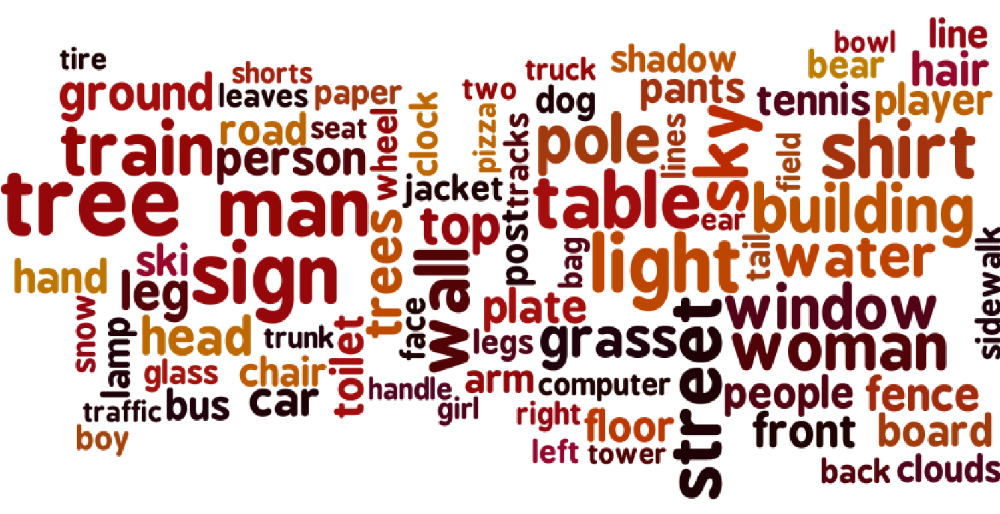
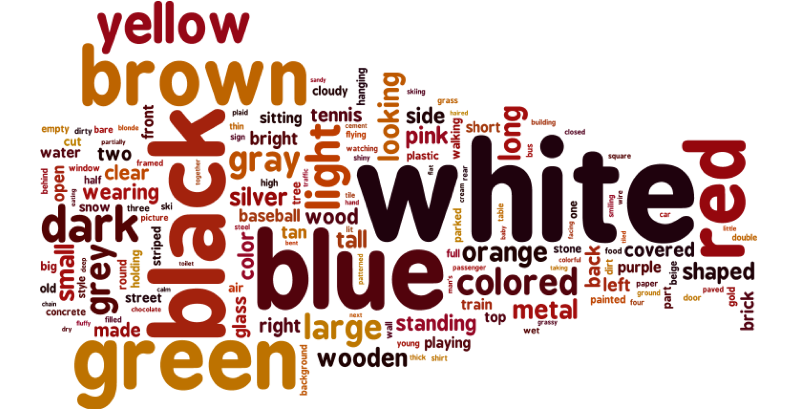
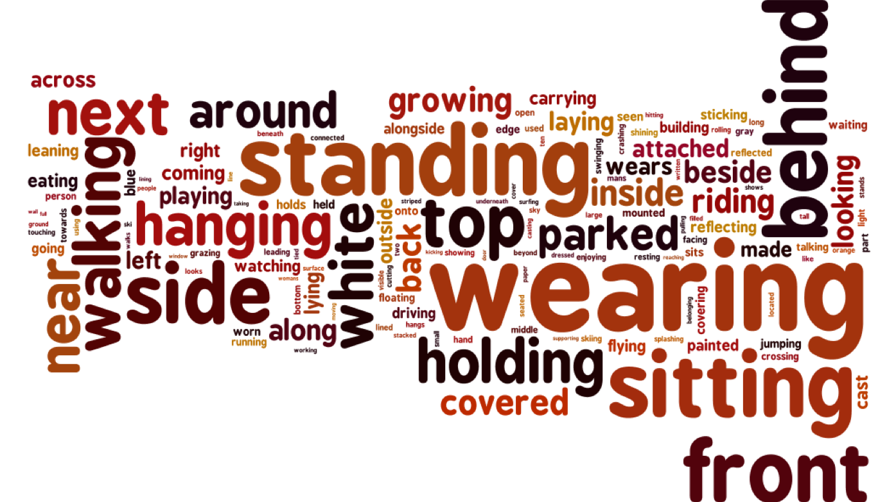

# VGPhraseCut Dataset


<table width="100%">
<tr>
<td></td>
</tr>
</table>
<table width="100%">
<tr>
<td> Category names</td>
<td> Attributes</td>
<td> Relationship predicates</td>
</tr>
<tr>
<td></td>
<td></td>
<td></td>
</tr>
</table>

## Introduction
VGPhraseCut Dataset is aimed for the problem of segmenting anything on 
a image based on a regional description phrase.

The dataset is collected based on 
[Visual Genome](https://visualgenome.org/).
It consists of 348,233 phrase-region pairs. 
Each phrase contains explicit annotations of which words describe 
category names, attributes, and relationships with other things 
in the image respectively.
The corresponding region described by the phrase is a binary 
segmentation mask on the image.

Our dataset consists of 348,233 phrases across 77,262 images. 
This roughly covers 70\% of the images in Visual Genome.
We split the dataset into 308,893 phrases (71,354 images) for training, 
20,350 (2971 images) for validation, and 18,980 (2937 images) for testing. 
We also provide an miniv split with 20 images 
for the convenience of debugging.

More dataset statistics and data collection pipeline can be found
in the paper. \# TODO: link to the paper.


## Links
[Webpage](https://people.cs.umass.edu/~chenyun/phrasecut/)

\# TODO: link to the paper.

## requirements
- python:3.7
- requests
- matplotlib


## Download the dataset
We suggest you clone this repository to folder `PhraseCutDataset`:
```
git clone git@github.com:ChenyunWu/PhraseCutDataset.git
```
And download all the dataset files into 
`PhraseCutDataset/data/VGPhraseCut_v0/`.

If you prefer to put the dataset elsewhere, 
simply change the 'dataset_dir' in [utils/file_paths.py](utils/file_paths.py) 

### 1. VGPhraseCut annotations
All VGPhraseCut annotation files can be downloaded through this
[Google Drive link](https://drive.google.com/drive/folders/1oxRFGV_JHZO6dZSpeBSXNf9J_VLCkgL0?usp=sharing). 

#### Metadata:
- `image_data_split3000.json`(15.8MB): 
List of image information from Visual Genome.
For each image, there is a 'dict' containing its
'image_id', 'coco_id', 'flickr_id', 'width', 'height', 'url',
and also its split in our VGPhraseCut dataset: 
'split'=train/val/test/miniv.  
- `name_att_rel_count.json`(348KB):
List of category names, attributes and relationship predicates 
in our dataset, together with their frequency.

#### Referring data:
- `refer_train.json`(399.2MB)
- `refer_val.json`(46.5MB)
- `refer_test.json`(46.6MB)
- `refer_miniv.json`(335KB)

They are separate files for the different splits. 
Each file contains a list of tasks. 
Each task stands for a phrase-region pair, organized as a 'dict' with 
following keys: 
- **task_id**: unique id for each phrase-region pair (constructed from image_id and ann_ids)
- **image_id**: image id from Visual Genome
- **ann_ids**: all object ids (in Visual Genome) that match with the phrase
- **instance_boxes**: list of referred instance boxes (xywh format)
- **Polygons**: list of "instance_polygons", same length as instance_boxes. 
"instance_polygons": list of "polygon"s for a single instance. 
"polygon": list of \[x, y\] points, representing one polygon.
- **phrase**: the referring phrase as a string
- **phrase_structure**: Structure of the phrase stored as
'dict' of ('name', 'attributes', 'relation_ids', 'relation_descriptions', 'type')
    - name: category name as a string
    - attributes: list of attributes as a list of strings    
    - relation_ids: list of relationship ids from Visual Genome
    - relation_descriptions: list of relation_descriptions. 
      Each relation_description is a tuple of two elements: 
      string for the predicate, string (name) for the supporting object
    - type: name (category name is unique), 
      attribute (att+name is unique), 
      relation (name+relation is unique), verbose (not unique)

#### (Optional) Visual Genome scene graph data:
- `scene_graphs_train.json`(486.1MB)
- `scene_graphs_val.json`(19.3MB)
- `scene_graphs_test.json`(19.2MB)
- `scene_graphs_miniv.json`(116KB)

Only needed if you want to use associated 
Visual Genome scene graph annotations together with our dataset.
They are the same as the scene graphs from Visual Genome v1.2,
with only annotations on images in our dataset.


#### (Optional) Skipped data:
- `skip.json`(11MB)

Only needed if you are interested in the phrases 
skipped by the annotators during data collection.
We provide 'task_id', 'image_id', 'ann_ids', 'phrase', 'phrase_structure',
and also **'reason'**: the reason why it is skipped,
where the annotator got to choose from "Wrong Description", 
"Not in Image", "Ambiguous Region", "Difficult to Select" and "Other".

### 2. Visual Genome images
All images used in our dataset are from Visual Genome.
We suggest having Visual Genome images under 
`PhraseCutDataset/data/VGPhraseCut_v0/images/`.

- If you already have Visual Genome images downloaded, 
you can simply use a symbolic link.

- We provide `download_images.py` which only downloads images
that are used in our dataset \(around 70\% of Visual Genome images\). 
It also provides options to only download images in certain splits. 
We use the "requests" python package.
    ```bash
    pip install requests
    cd PhraseCutDataset
    python download_images.py
    # if you only want to download the miniv split:
    python download_images.py -s miniv
    ```

- Another option is to download all the images from 
[Visual Genome](https://visualgenome.org/api/v0/api_home.html).
You will need images from Version 1.2 in both part1 (9.2GB) and part2 
(5.47GB).

## Explore the dataset 
[dataset_demo.ipynb](dataset_demo.ipynb) shows the usage of our data loader and displays example annotations in our dataset.

## Evaluation
Input predictions, we report:
- Mean/cumulative box IoU (predicted boxes against ground-truth boxes), if predicted boxes are provided
- Mean/cumulative mask IoU (predicted mask against ground-truth mask), if predicted masks are provided
- Box / mask accuracy: percentage of predictions where the box / mask IoU is above a threshold
(Thresholds: 0.3, 0.5, 0.7, 0.9)

The statistics can be reported on each subset separately. See [utils/subset.py](utils/subset.py) for supported subsets.


### Option 1: Save predictions to file, and evaluate them afterwards
- **Save predictions to a numpy file.** 
It should be a 'dict' of task_id --> binary predicted mask (compressed).
We provide examples of naive predictors in [utils/predictor_examples.py](utils/predictor_examples.py).
- **Evaluate.** 
Run `python evaluate.py --pred_name=your_method_name --pred_path=path/to/your/predictions.npy`.
The optional 'pred_name' is only used to log results to summary files 
for the convenience of comparing different methods.

### Option 2: Evaluate after each task is predicted
Saving all the prediction results to a file can take up a lot of space and time. 
We provide the ['Evaluator'](utils/evaluator.py) class to update the evaluation after each task is predicted,
so that predictions on previous tasks do not need to be saved.

First initialize an evaluator, 
then enumerate over the tasks and call 'evaluator.eval_single_img\(...\)' after predicting on each referring phrase,
finally call 'evaluator.analyze_stats\(...\)' to get the final evaluation results.
See the 'evaluate_from_pred_dict' function in [evaluate.py] as an example.


## Visualization
We provide a tool to visualize prediction results in html files, 
align with ground-truth and \(optionally\) other baselines.
Run `python visualize.py -p path/to/your/predictions.npy`, 
and the visualizations will be created in the same directory.

Similar as the 'Evaluator', we also provide a ['Visualizer'](utils/visualizer.py) 
to generate visualizations after predicting on each task, avoiding saving all the prediction results. 

To try out the evaluation and visualization code on our naive predictors, you can simply run:
    ``` bash
    # from the "PhraseCutDataset" directory:
    python evaluate.py -n ins_rand
    python visualize.py -p output/baselines/ins_rand/miniv/pred_eval.npy 
    ```

## Additional utilities
- [**Simple predictors**](utils/predictor_examples.py): example naive predictors.
- **Loaders**: 
[RefVGLoader](utils/refvg_loader.py) loads the dataset from files. 
It uses [PhraseHandler](utils/phrase_handler.py) to handle the phrases,
and (optionally) [VGLoader](utils/vg_loader.py) to load Visual Genome scene graphs.
- [**ThreshBinSearcher**](utils/find_thresh.py): 
efficiently searches the thresholds on final prediction scores 
given the overall percentage of pixels predicted as the referred region. 
- [**Data transfer**](utils/data_transfer.py):
changes representations of boxes, polygons, masks, etc.
- [**IoU**](utils/iou.py):
calculates IoU between boxes, polygons, masks, etc.
- [**Subset**](utils/subset.py):
decides qualified subsets for each task (phrase-region pair).  


